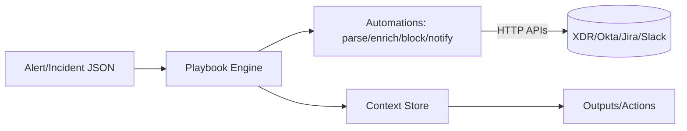

# Architecture

```mermaid
flowchart LR
A[Alert/Incident JSON] --> B[Playbook Engine]
B --> C[Automations: parse/enrich/block/notify]
C -->|HTTP APIs| D[(XDR/Okta/Jira/Slack)]
B --> E[Context Store]
E --> F[Outputs/Actions]
```
